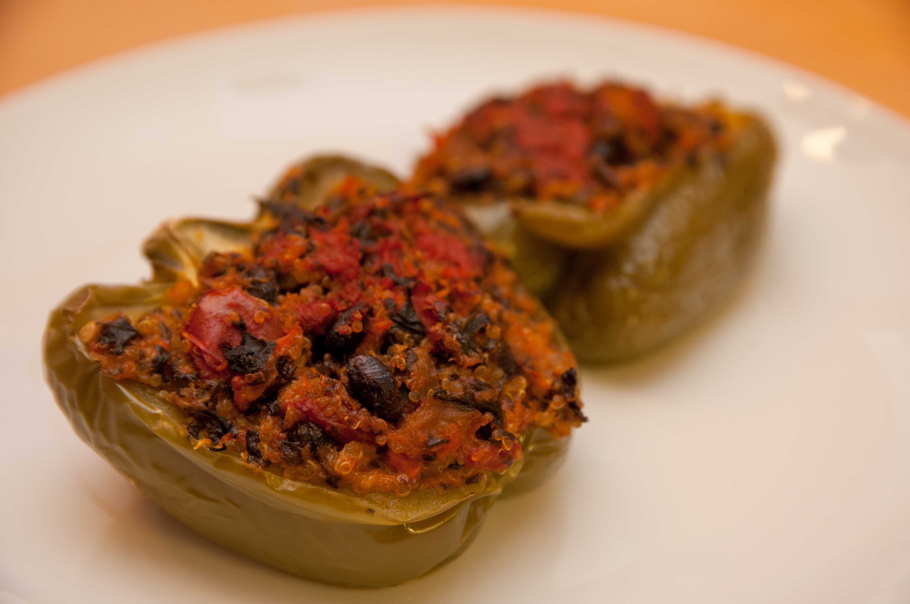

# Low-Carb Recipe Book

Created for quick, practical meals with lower net carbs and simple ingredients.

## Table of Contents
- [How to Use This Book](#how-to-use-this-book)
- [Macro Key](#macro-key)
- [1) Spinach Feta Egg Muffins](#1-spinach-feta-egg-muffins)
- [2) Greek Chicken Salad Bowls](#2-greek-chicken-salad-bowls)
- [3) Garlic Butter Salmon with Asparagus](#3-garlic-butter-salmon-with-asparagus)
- [4) Zucchini Noodle Turkey Bolognese](#4-zucchini-noodle-turkey-bolognese)
- [5) Cauliflower Fried Rice](#5-cauliflower-fried-rice)
- [6) Taco Stuffed Bell Peppers](#6-taco-stuffed-bell-peppers)
- [7) Creamy Tuscan Chicken](#7-creamy-tuscan-chicken)
- [8) Broccoli Cheddar Soup (Low-Carb)](#8-broccoli-cheddar-soup-low-carb)
- [9) Sheet Pan Sausage and Veggies](#9-sheet-pan-sausage-and-veggies)
- [10) Chia Vanilla Pudding](#10-chia-vanilla-pudding)
- [11) Greek Yogurt Bowl with Walnuts and Cinnamon](#11-greek-yogurt-bowl-with-walnuts-and-cinnamon)
- [12) Lemon-Basil Yogurt Sauce](#12-lemon-basil-yogurt-sauce)
- [13) Smoky Tomato-Oregano Sauce](#13-smoky-tomato-oregano-sauce)
- [14) Protein Balls](#14-protein-balls)
- [15) Viral Cottage Cheese Flatbread Wrap](#15-viral-cottage-cheese-flatbread-wrap)
- [Sauce Pairing Guide](#sauce-pairing-guide)
- [7-Day Low-Carb Meal Flow (Optional)](#7-day-low-carb-meal-flow-optional)
- [7-Day Meal Flow Shopping List (Auto-Generated)](#7-day-meal-flow-shopping-list-auto-generated)
- [Pantry and All-Recipes Staples (Auto-Generated)](#pantry-and-all-recipes-staples-auto-generated)

## How to Use This Book
- **Serving sizes:** Most recipes serve 2-4.
- **Net carbs:** Estimated as total carbs minus fiber.
- **Macros:** Estimated per serving (calories, protein, fat, total carbs).
- **Protein-forward:** Meals are built to be filling and blood-sugar friendly.

---

## Macro Key
- **Raise protein:** add lean meat, egg whites, or plain Greek yogurt.
- **Raise healthy fats:** add olive oil, avocado, nuts, or seeds.
- **Lower carbs:** swap starchy ingredients for non-starchy vegetables.
- **Lower calories:** reduce oils, cheese, or high-fat add-ins.
- **Portion shortcut:** if macros feel high, start with 3/4 serving.

---

## 1) Spinach Feta Egg Muffins

**Serves:** 6 (1 muffin each)  
**Estimated net carbs:** ~1.6g per muffin
**Estimated macros:** ~170 cal | 11g protein | 13g fat | 2g carbs

### Ingredients
- 8 large eggs
- 1 cup chopped spinach
- 1/3 cup crumbled feta
- 1/3 cup cooked crumbled bacon (about 4 slices)
- 1/4 cup diced red bell pepper
- 1 tbsp olive oil
- Salt and pepper

### Instructions
1. Heat oven to 375 F. Grease a 6-cup muffin tin.
2. Saute spinach and bell pepper in olive oil for 2-3 minutes.
3. Whisk eggs with salt and pepper. Stir in vegetables, feta, and crumbled bacon.
4. Divide into muffin cups and bake 18-20 minutes.

---

## 2) Greek Chicken Salad Bowls

**Serves:** 4  
**Estimated net carbs:** ~7g per serving
**Estimated macros:** ~420 cal | 45g protein | 22g fat | 9g carbs

### Ingredients
- 1.5 lb chicken breast, cooked and sliced
- 6 cups chopped romaine
- 1 cup cucumber, diced
- 1/2 cup cherry tomatoes, halved
- 1/3 cup olives, sliced
- 1/3 cup feta
- 3 tbsp olive oil
- 2 tbsp lemon juice
- 1 tsp dried oregano
- Salt and pepper

### Instructions
1. Combine romaine, cucumber, tomatoes, olives, and feta.
2. Whisk olive oil, lemon juice, oregano, salt, and pepper.
3. Top salad with chicken and drizzle dressing before serving.

---

## 3) Garlic Butter Salmon with Asparagus

**Serves:** 4  
**Estimated net carbs:** ~5g per serving
**Estimated macros:** ~410 cal | 34g protein | 27g fat | 6g carbs

### Ingredients
- 4 salmon fillets
- 1 lb asparagus, trimmed
- 3 tbsp butter
- 3 cloves garlic, minced
- 1 tbsp lemon juice
- Salt, pepper, paprika

### Instructions
1. Heat oven to 400 F. Place salmon and asparagus on a sheet pan.
2. Melt butter, stir in garlic and lemon juice.
3. Brush over salmon and asparagus. Season.
4. Bake 12-15 minutes until salmon flakes easily.

---

## 4) Zucchini Noodle Turkey Bolognese

**Serves:** 4  
**Estimated net carbs:** ~8g per serving
**Estimated macros:** ~360 cal | 32g protein | 20g fat | 10g carbs

### Ingredients
- 1.25 lb ground turkey
- 1 tbsp olive oil
- 1/2 onion, finely diced
- 2 cloves garlic, minced
- 1.5 cups no-sugar-added marinara
- 4 medium zucchinis, spiralized
- 1 tsp Italian seasoning
- Salt and pepper

### Instructions
1. Brown turkey in olive oil. Add onion and garlic; cook 3 minutes.
2. Add marinara, seasoning, salt, and pepper. Simmer 10 minutes.
3. Saute zucchini noodles 2-3 minutes (do not overcook).
4. Serve turkey sauce over zucchini noodles.

---

## 5) Cauliflower Fried Rice

**Serves:** 4  
**Estimated net carbs:** ~6g per serving
**Estimated macros:** ~280 cal | 19g protein | 17g fat | 9g carbs

### Ingredients
- 1 large bag cauliflower rice (about 4 cups)
- 2 eggs, beaten
- 1 cup diced cooked chicken (or shrimp)
- 1/2 cup frozen peas and carrots mix (optional, small amount)
- 2 green onions, sliced
- 2 tbsp soy sauce or coconut aminos
- 1 tbsp sesame oil
- 1 tbsp avocado oil

### Instructions
1. Heat avocado oil in a large skillet.
2. Scramble eggs and set aside.
3. Add cauliflower rice; cook 4-5 minutes.
4. Stir in chicken, peas/carrots, green onions, soy sauce, sesame oil, and eggs.
5. Cook 2 more minutes and serve.

---

## 6) Taco Stuffed Bell Peppers

**Serves:** 4  
**Estimated net carbs:** ~9g per serving
**Estimated macros:** ~430 cal | 28g protein | 30g fat | 12g carbs

### Ingredients
- 4 bell peppers, halved and seeded
- 1 lb ground beef
- 1 tbsp olive oil
- 2 tsp taco seasoning (no sugar)
- 1/2 cup salsa (no sugar added)
- 1 cup shredded cheddar
- Optional toppings: sour cream, avocado, cilantro

### Instructions
1. Heat oven to 375 F. Place pepper halves in baking dish.
2. Brown beef in olive oil; stir in taco seasoning and salsa.
3. Fill pepper halves with beef mixture.
4. Cover and bake 25 minutes.
5. Uncover, add cheese, bake 8-10 more minutes.

---

## 7) Creamy Tuscan Chicken

**Serves:** 4  
**Estimated net carbs:** ~7g per serving
**Estimated macros:** ~520 cal | 37g protein | 37g fat | 8g carbs

### Ingredients
- 1.5 lb chicken thighs or breasts
- 1 tbsp olive oil
- 2 cloves garlic, minced
- 1 cup heavy cream
- 1/3 cup grated parmesan
- 1 cup spinach
- 1/3 cup sun-dried tomatoes (not packed in sugar)
- Salt, pepper, Italian seasoning

### Instructions
1. Season chicken and sear in olive oil until cooked through; remove.
2. In same pan, saute garlic 30 seconds.
3. Add cream and parmesan; stir until slightly thick.
4. Add spinach and sun-dried tomatoes.
5. Return chicken to pan and simmer 2-3 minutes.

---

## 8) Broccoli Cheddar Soup (Low-Carb)

**Serves:** 4  
**Estimated net carbs:** ~8g per serving
**Estimated macros:** ~390 cal | 14g protein | 31g fat | 11g carbs

### Ingredients
- 3 cups broccoli florets, chopped
- 2 tbsp butter
- 1/4 onion, minced
- 2 cups chicken broth
- 1 cup heavy cream
- 1.5 cups shredded cheddar
- Salt, pepper, pinch nutmeg

### Instructions
1. Saute onion in butter until soft.
2. Add broccoli and broth; simmer 10-12 minutes.
3. Blend part of soup for texture (optional).
4. Stir in cream, cheddar, and seasonings on low heat.
5. Cook until cheese melts; do not boil.

---

## 9) Sheet Pan Sausage and Veggies

**Serves:** 4  
**Estimated net carbs:** ~9g per serving
**Estimated macros:** ~430 cal | 16g protein | 33g fat | 12g carbs

### Ingredients
- 1 lb smoked sausage (check carbs), sliced
- 1 zucchini, chopped
- 1 red bell pepper, chopped
- 1 cup broccoli florets
- 1/2 red onion, sliced
- 2 tbsp olive oil
- 1 tsp garlic powder
- 1 tsp paprika
- Salt and pepper

### Instructions
1. Heat oven to 425 F.
2. Toss all ingredients on a sheet pan.
3. Roast 20-25 minutes, stirring once halfway.

---

## 10) Chia Vanilla Pudding

**Serves:** 4  
**Estimated net carbs:** ~4g per serving
**Estimated macros:** ~220 cal | 7g protein | 14g fat | 9g carbs

### Ingredients
- 1.5 cups unsweetened almond milk
- 1/2 cup chia seeds
- 1 tsp vanilla extract
- 2-3 tsp monk fruit sweetener or erythritol
- Optional: berries (small portion), chopped nuts

### Instructions
1. Whisk almond milk, vanilla, and sweetener.
2. Stir in chia seeds well.
3. Refrigerate 3+ hours (or overnight), stirring once after 10 minutes.
4. Serve cold with optional toppings.

---

## 11) Greek Yogurt Bowl with Walnuts and Cinnamon

**Serves:** 1 bowl  
**Estimated net carbs:** ~9g per bowl (without optional fruit)
**Estimated macros:** ~280 cal | 26g protein | 15g fat | 10g carbs

### Ingredients
- 1 cup plain Greek yogurt (2% or whole)
- 2 tbsp walnuts, roughly chopped
- 1/2 tsp ground cinnamon
- Pinch of salt (optional)

### Optional Add-Ins (choose 1-2)
- 1/2 cup strawberries, sliced
- 1 tsp chia seeds
- 1/2 tsp vanilla extract
- 1 scoop collagen

### Instructions
1. Add Greek yogurt to a bowl.
2. Stir in cinnamon and a pinch of salt.
3. Top with walnuts and any optional add-ins.

### Notes
- For extra sweetness without refined sugar, add berries.
- For a thicker texture, use strained Greek yogurt.

---

## 12) Lemon-Basil Yogurt Sauce

**Yield:** about 1 cup  
**Estimated net carbs:** ~1.5g per 2 tbsp
**Estimated macros:** ~35 cal | 2g protein | 2g fat | 2g carbs (per 2 tbsp)

### Ingredients
- 1 cup plain Greek yogurt
- 1 small garlic clove, finely grated (or 1/2 tsp garlic powder)
- Zest of 1 lemon
- 1-2 tbsp lemon juice, to taste
- 2 tbsp fresh basil, finely chopped
- 1/2 tsp salt
- Black pepper, to taste
- 1-2 tsp olive oil (optional)

### Instructions
1. Stir all ingredients together in a bowl.
2. Rest 5 minutes to let flavors blend.
3. Adjust salt and lemon juice to taste.

### Notes
- Keeps 4-5 days refrigerated.
- Works as a marinade base; thin with a splash of water if needed.

---

## 13) Smoky Tomato-Oregano Sauce

**Yield:** about 2 cups  
**Estimated net carbs:** ~3g per 1/4 cup
**Estimated macros:** ~45 cal | 1g protein | 2g fat | 6g carbs (per 1/4 cup)

### Ingredients
- 1 tbsp olive oil
- 2 cloves garlic, minced (or 1 tsp garlic powder)
- 1 (14-28 oz) can San Marzano tomatoes, crushed by hand
- 1 tsp oregano
- 1/2 tsp smoked paprika
- 1/2 tsp salt, plus more to taste
- Pinch of chili flakes (optional)

### Instructions
1. Warm olive oil in a saucepan over medium heat.
2. Add garlic and cook 30-60 seconds.
3. Add tomatoes, oregano, smoked paprika, salt, and chili flakes.
4. Simmer 12-15 minutes, then taste and adjust seasoning.

### Notes
- Great on chicken thighs, meatballs, or as a shakshuka base.
- Freezes well.

---

## 14) Protein Balls

**Yield:** about 16 balls  
**Estimated net carbs:** ~3.5g per ball (without chocolate chips)
**Estimated macros:** ~115 cal | 6g protein | 8g fat | 5g carbs (per ball)

### Ingredients
- 1 1/2 cups almond flour
- 1 cup peanut butter
- 1/4 cup sugar-free maple syrup
- 2 scoops protein powder (chocolate whey works well)

### Optional Add-Ins
- 1/4 cup flaxseed meal
- 1/4 cup chia seeds
- Chocolate chips, to taste

### Instructions
1. Add almond flour, peanut butter, sugar-free syrup, and protein powder to a bowl.
2. Mix until evenly combined.
3. Fold in any optional add-ins.
4. Scoop and roll into 16 balls.
5. Chill for 20-30 minutes before serving.

### Notes
- Store in an airtight container in the fridge for up to 5 days.
- If mixture is too dry, add 1-2 tbsp water or almond milk.

---

## 15) Viral Cottage Cheese Flatbread Wrap

**Serves:** 2 wraps  
**Estimated net carbs:** ~4g per wrap
**Estimated macros:** ~130 cal | 13g protein | 6g fat | 5g carbs

### Ingredients
- 1 cup cottage cheese (full-fat or low-fat)
- 2 large eggs
- 1/2 tsp garlic powder
- 1/2 tsp Italian seasoning
- Pinch of salt and black pepper

### Optional Fillings
- Sliced turkey or rotisserie chicken
- Romaine or spinach
- Cucumber, tomato, red onion
- Lemon-Basil Yogurt Sauce

### Instructions
1. Heat oven to 375 F and line a sheet pan with parchment.
2. Blend cottage cheese, eggs, garlic powder, Italian seasoning, salt, and pepper until smooth.
3. Pour onto sheet pan and spread into a rectangle about 1/4 inch thick.
4. Bake 25-30 minutes until set and lightly golden.
5. Cool 5-10 minutes, then slice into 2 large pieces and fill like wraps.

### Notes
- For a sturdier wrap, bake 3-5 extra minutes.
- Store plain baked flatbread in the fridge up to 3 days.

---

## Sauce Pairing Guide
- **Lemon-Basil Yogurt Sauce:** salmon, grilled chicken, shrimp bowls, roasted veggies, taco peppers
- **Smoky Tomato-Oregano Sauce:** turkey meatballs, chicken thighs, zucchini noodles, cauliflower rice, shakshuka-style eggs
- **Easy weekly move:** prep both sauces on Sunday and use them across 3-4 dinners

---

## 7-Day Low-Carb Meal Flow (Optional)
- **Day 1:** Egg Muffins / Greek Chicken Salad / Salmon + Asparagus + Lemon-Basil Yogurt Sauce
- **Day 2:** Greek Yogurt Bowl / Leftover Salmon Salad / Taco Peppers + Smoky Tomato-Oregano Sauce
- **Day 3:** Egg Muffins / Cauliflower Fried Rice / Tuscan Chicken + Lemon-Basil Yogurt Sauce
- **Day 4:** Greek Yogurt Bowl / Greek Salad Bowl / Sausage + Veggies + Smoky Tomato-Oregano Sauce
- **Day 5:** Egg Muffins / Leftover Tuscan Chicken / Zoodle Bolognese + Smoky Tomato-Oregano Sauce
- **Day 6:** Greek Yogurt Bowl / Broccoli Cheddar Soup / Taco Peppers + Lemon-Basil Yogurt Sauce
- **Day 7:** Chia Pudding / Soup + Side Salad / Salmon + Asparagus + Lemon-Basil Yogurt Sauce

---

## 7-Day Meal Flow Shopping List (Auto-Generated)
- Generated from recipes referenced in the current 7-day meal flow.
- **Proteins:** chicken breast, chicken thighs, eggs, ground beef, ground turkey, salmon, smoked sausage
- **Produce:** asparagus, bell peppers, broccoli, cherry tomatoes, cucumber, fresh basil, garlic, green onions, lemon, lemon juice, onion, romaine, spinach, sun-dried tomatoes, zucchini
- **Dairy:** butter, cheddar, feta, greek yogurt, heavy cream, parmesan
- **Pantry:** almond milk, avocado oil, cauliflower rice, chia seeds, chicken broth, cinnamon, coconut aminos, italian seasoning, monk fruit sweetener, olive oil, olives, oregano, salsa, san marzano tomatoes, sesame oil, smoked paprika, soy sauce, taco seasoning, walnuts

## Pantry and All-Recipes Staples (Auto-Generated)
- Generated from ingredients across all recipes in `recipes/`.
- **Proteins:** chicken breast, chicken thighs, eggs, ground beef, ground turkey, protein powder, salmon, smoked sausage
- **Produce:** asparagus, bell peppers, broccoli, cherry tomatoes, cucumber, fresh basil, garlic, green onions, lemon, lemon juice, onion, romaine, spinach, sun-dried tomatoes, zucchini
- **Dairy:** butter, cheddar, cottage cheese, feta, greek yogurt, heavy cream, parmesan
- **Pantry:** almond flour, almond milk, avocado oil, cauliflower rice, chia seeds, chicken broth, cinnamon, coconut aminos, italian seasoning, monk fruit sweetener, olive oil, olives, oregano, peanut butter, salsa, san marzano tomatoes, sesame oil, smoked paprika, soy sauce, sugar-free maple syrup, taco seasoning, walnuts
