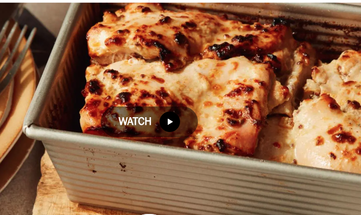

# Juicy Loaf Pan Chicken

**Serves:** 6  
**Estimated net carbs:** ~2g per serving
**Estimated macros:** ~430 cal | 38g protein | 30g fat | 3g carbs

### Ingredients
- 3 lb boneless, skinless chicken thighs
- Kosher salt and black pepper
- 3 garlic cloves, grated
- Zest from 1 lemon (about 2 strips) and 1/4 cup lemon juice
- 1 small shallot, finely chopped
- 1/4 cup extra-virgin olive oil
- 1/4 cup full-fat Greek yogurt
- 1 tbsp fresh thyme, finely chopped
- 2 tsp Dijon mustard
- 2 tsp whole-grain mustard
- 1/2 tsp honey (optional)
- 1/2 tsp crushed red pepper flakes
- Nonstick spray, for the pan
- 1 tsp paprika

### Instructions
1. Season chicken thighs with salt and black pepper.
2. In a large bowl, combine garlic, lemon zest, lemon juice, and shallot; let stand 5 minutes.
3. Whisk in olive oil, yogurt, thyme, Dijon, whole-grain mustard, optional honey, red pepper flakes, 1 tbsp kosher salt, and black pepper.
4. Add chicken and coat thoroughly. Cover and refrigerate 2 to 6 hours.
5. Let chicken sit at room temperature for about 45 to 60 minutes before baking.
6. Heat oven to 425 F. Spray a 9x5 loaf pan and coat the inside with paprika.
7. Layer marinated thighs tightly in the pan and bake 40 to 50 minutes, until center reaches 160 F.
8. Spoon juices over top, then carefully pour off excess juices.
9. Broil 1 to 2 minutes until edges char lightly. Rest 10 minutes, invert, and slice thin.

### Notes
- Source adaptation: Food Network Kitchen, Juicy Loaf Pan Chicken.
- To keep it lower-carb, omit the honey and serve with salad, cauliflower rice, or roasted vegetables.
