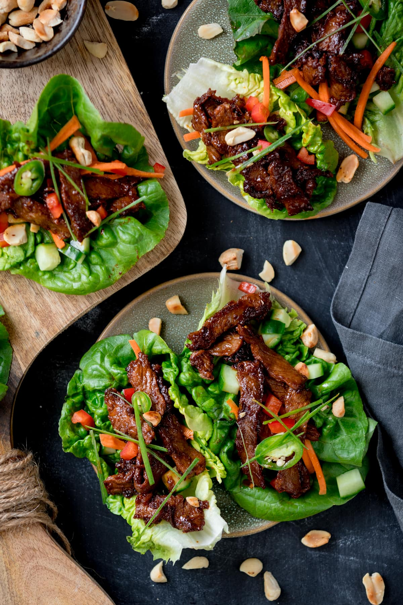

# Korean Beef Lettuce Wraps

**Serves:** 4  
**Estimated net carbs:** ~7g per serving
**Estimated macros:** ~360 cal | 25g protein | 24g fat | 10g carbs

### Ingredients
- 1 tbsp avocado oil
- 1 lb ground beef (85/15)
- 1/2 small onion, finely diced
- 2 garlic cloves, minced
- 1 tsp fresh ginger, grated
- 1/4 cup coconut aminos
- 1 tbsp rice vinegar
- 1 tsp toasted sesame oil
- 1 tsp sugar-free sweetener (optional)
- 1/2 tsp red pepper flakes or gochugaru
- 1/2 cup cucumber, finely diced
- 1/4 cup jicama, finely diced (for extra crunch)
- 2 green onions, sliced
- 1 head butter lettuce, leaves separated

### Optional Add-Ins
- 1 tsp sesame seeds
- Sriracha to taste
- Fresh cilantro

### Instructions
1. Heat avocado oil in a large skillet over medium-high.
2. Add beef and onion; cook until beef is browned.
3. Stir in garlic and ginger; cook 30 seconds.
4. Add coconut aminos, rice vinegar, sesame oil, optional sweetener, and red pepper flakes. Simmer 2-3 minutes until glossy.
5. Fold in cucumber, jicama, and green onions. Cook 30 seconds to keep crunch.
6. Spoon filling into lettuce leaves and serve immediately.

### Notes
- Crunch is built in with cucumber and jicama to mimic the bite you get from water chestnuts.
- Source concept adaptation: Kitchen Sanctuary Korean Beef Lettuce Wraps, adjusted for lower carb ingredients.
