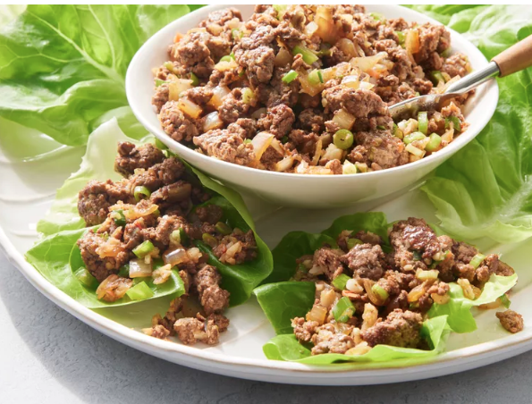

# Low-Carb Asian Lettuce Wraps

**Serves:** 4  
**Estimated net carbs:** ~7g per serving
**Estimated macros:** ~330 cal | 22g protein | 22g fat | 9g carbs

### Ingredients
- 1 tbsp avocado oil or olive oil
- 1 lb ground chicken or turkey
- 1/2 small onion, finely diced
- 2 garlic cloves, minced
- 1 tsp fresh ginger, grated
- 1/2 cup jicama, finely diced (for crunch)
- 1/4 cup low-sugar coconut aminos
- 1 tbsp rice vinegar
- 1 tsp toasted sesame oil
- 1 tsp chili-garlic paste (optional)
- 1 tsp sugar-free sweetener (optional, to balance)
- 2 green onions, sliced
- 1 head butter lettuce or romaine leaves, separated

### Optional Add-Ins
- 1 tbsp chopped peanuts or cashews (small sprinkle)
- 1 tsp sesame seeds
- Sriracha or chili crisp

### Instructions
1. Heat oil in a large skillet over medium-high heat.
2. Add ground meat and cook until browned, breaking it apart.
3. Add onion, garlic, and ginger; cook 2-3 minutes until fragrant.
4. Stir in diced jicama and cook 1-2 minutes so it stays crisp.
5. Add coconut aminos, rice vinegar, sesame oil, and optional chili-garlic paste and sweetener.
6. Simmer 2 minutes until glossy, then stir in green onions.
7. Spoon filling into lettuce leaves and serve immediately.

### Notes
- Crunch replacement for water chestnuts: jicama gives a similar crisp bite with fewer carbs.
- Source concept adaptation: Allrecipes Asian Lettuce Wraps (low-carb adjusted).
