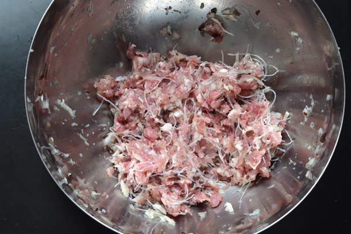

# Pork Egg Roll in a Bowl

**Serves:** 4  
**Estimated net carbs:** ~7g per serving
**Estimated macros:** ~390 cal | 22g protein | 29g fat | 10g carbs

### Ingredients
- 1 tbsp avocado oil
- 1 lb ground pork
- 1 small onion, finely diced
- 3 cloves garlic, minced
- 1 tbsp fresh ginger, grated
- 6 cups shredded cabbage or coleslaw mix
- 2 tbsp coconut aminos
- 1 tbsp rice vinegar
- 1 tsp toasted sesame oil
- 2 green onions, sliced
- Salt and black pepper, to taste

### Optional Add-Ins
- 1/4 cup diced jicama for extra crunch
- Chili crisp or sriracha
- Sesame seeds

### Instructions
1. Heat oil in a large skillet over medium-high.
2. Add pork and onion; cook until browned.
3. Stir in garlic and ginger; cook 30 seconds.
4. Add cabbage and cook 3-5 minutes until just tender-crisp.
5. Stir in coconut aminos, rice vinegar, sesame oil, and green onions.
6. Season to taste and serve hot.

### Notes
- Keep cabbage slightly crisp for the best texture.
