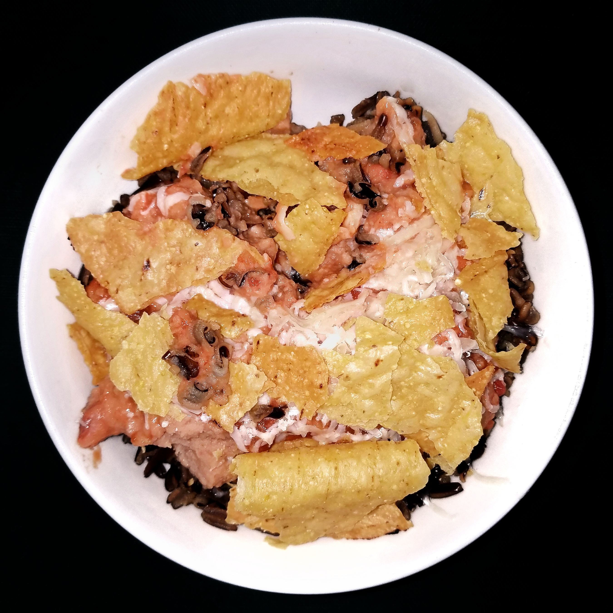

# Viral Cottage Cheese Taco Bowl

**Serves:** 4  
**Estimated net carbs:** ~7g per serving
**Estimated macros:** ~355 cal | 36g protein | 18g fat | 10g carbs

### Ingredients
- 1.25 lb lean ground beef or turkey
- 1 tbsp olive oil (optional, if using very lean meat)
- 2 tbsp taco seasoning (no sugar added)
- 1/3 cup water
- 2 cups 2% cottage cheese
- 1 cup shredded romaine
- 1 cup diced cucumber
- 1 cup cherry tomatoes, halved
- 1 avocado, diced
- 1/2 cup shredded cheddar
- 1/4 cup red onion, finely diced
- 1/4 cup chopped cilantro
- Juice of 1 lime
- Salt and pepper, to taste

### Optional Add-Ins
- Pickled jalapenos
- Salsa verde
- Hot sauce

### Instructions
1. Brown meat in a skillet over medium-high heat. Drain excess fat if needed.
2. Stir in taco seasoning and water. Simmer 2-3 minutes until coated and slightly thick.
3. Build each bowl with cottage cheese, lettuce, cucumber, tomatoes, avocado, cheddar, and red onion.
4. Top with warm taco meat, cilantro, and lime juice.
5. Season with salt and pepper, then add any optional toppings.

### Notes
- For meal prep, keep warm meat separate and assemble with cold toppings right before eating.
- You can swap ground chicken for a lighter version.
