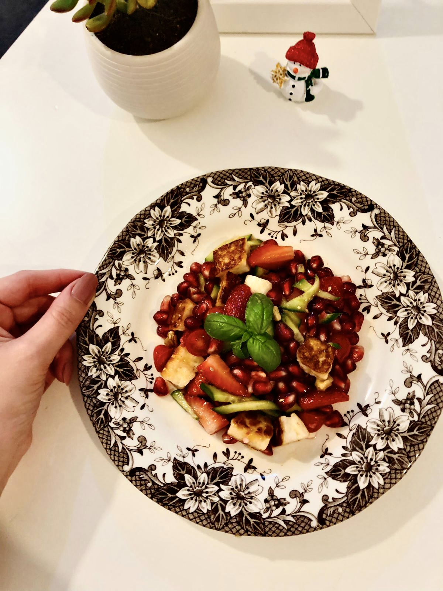

# Zucchini Ribbon Salad with Halloumi and Mint

**Serves:** 4  
**Estimated net carbs:** ~6g per serving
**Estimated macros:** ~280 cal | 14g protein | 21g fat | 8g carbs

### Ingredients
- 3 medium zucchini, shaved into ribbons
- 8 oz halloumi cheese, sliced
- 1 tbsp olive oil
- 2 tbsp fresh mint, chopped
- 1 tbsp lemon juice
- 1 tsp lemon zest
- Salt and black pepper, to taste

### Optional Add-Ins
- 1 tbsp toasted pine nuts
- 1 tbsp chopped dill
- Cracked red pepper

### Instructions
1. Heat a skillet over medium-high and sear halloumi 1-2 minutes per side until golden.
2. Toss zucchini ribbons with olive oil, lemon juice, lemon zest, salt, and pepper.
3. Plate zucchini, top with warm halloumi, and finish with mint.
4. Add optional toppings and serve immediately.

### Notes
- Best served right away while the halloumi is warm and crisp.
