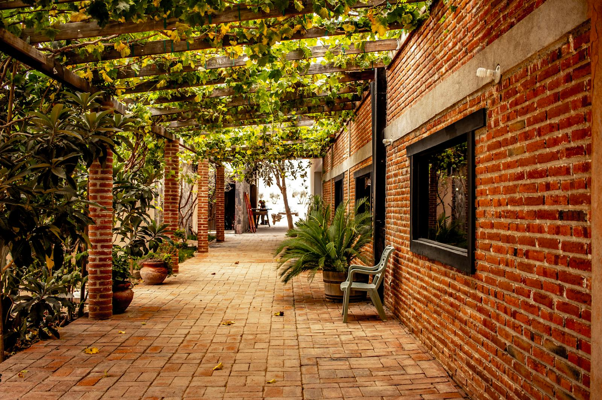

# Protein Balls

**Yield:** about 16 balls  
**Estimated net carbs:** ~3.5g per ball (without chocolate chips)
**Estimated macros:** ~115 cal | 6g protein | 8g fat | 5g carbs (per ball)

### Ingredients
- 1 1/2 cups almond flour
- 1 cup peanut butter
- 1/4 cup sugar-free maple syrup
- 2 scoops protein powder (chocolate whey works well)

### Optional Add-Ins
- 1/4 cup flaxseed meal
- 1/4 cup chia seeds
- Chocolate chips, to taste

### Instructions
1. Add almond flour, peanut butter, sugar-free syrup, and protein powder to a bowl.
2. Mix until evenly combined.
3. Fold in any optional add-ins.
4. Scoop and roll into 16 balls.
5. Chill for 20-30 minutes before serving.

### Notes
- Store in an airtight container in the fridge for up to 5 days.
- If mixture is too dry, add 1-2 tbsp water or almond milk.
